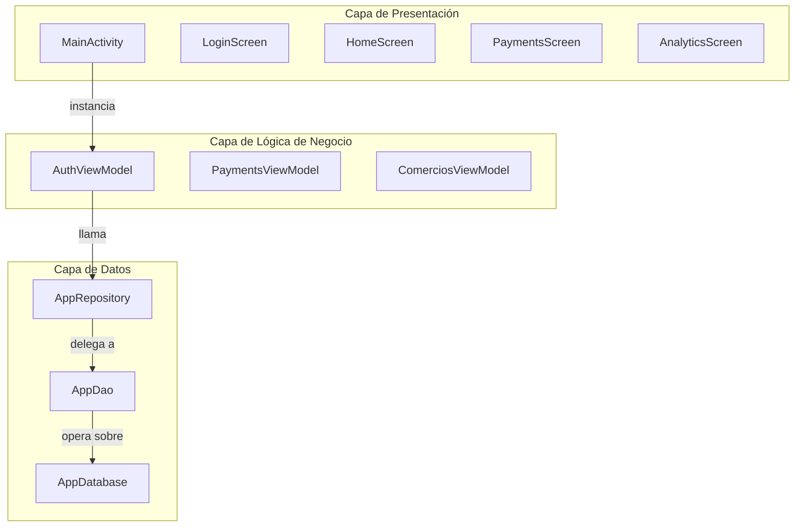
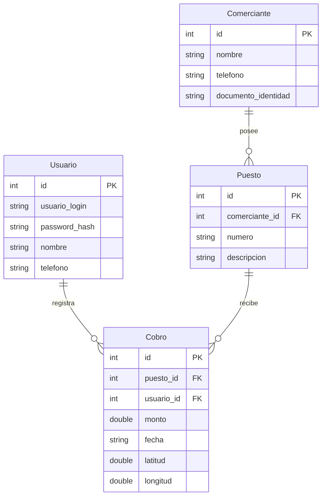

# CobrosMercadoApp

Aplicación Android para la gestión y recolección de pagos en mercados, diseñada para operar completamente offline con base de datos local SQLite y mapas integrados de El Salvador.

<div style="display: flex; justify-content: center; gap: 10px;">
  
  
    
</div>

## 🌟 Características Principales

- **Arquitectura Offline-First**: Operación completa sin conexión a internet usando Room SQLite y mapas embebidos
- **Gestión de Pagos**: Registro de cobros con geolocalización y seguimiento de métricas financieras
- **Autenticación Segura**: Sistema de login con BCrypt y persistencia de sesión
- **Dashboard Analítico**: Visualización de métricas en tiempo real con gráficos interactivos
- **Mapas Offline**: Visualización de ubicaciones de pagos usando Mapsforge
- **Gestión de Comerciantes**: CRUD completo para comerciantes y sus puestos

## 🛠 Tecnologías

| Tecnología | Versión | Propósito |
|------------|---------|---------|
| Kotlin | 2.0.21 | Lenguaje principal con corrutinas |
| Jetpack Compose | BOM 2024.06.00 | UI declarativa con Material3 |
| Room Database | 2.6.1 | Persistencia SQLite con KSP |
| Navigation Compose | 2.8.0 | Navegación type-safe |
| BCrypt | 0.10.2 | Hashing de contraseñas |
| Mapsforge | 0.25.0 | Renderizado de mapas offline | 

## 🏗 Arquitectura

La aplicación sigue una arquitectura de tres capas con separación clara de responsabilidades:



## 📁 Estructura del Proyecto

```
app/src/main/java/com/example/cobrosmercadoapp/
├── MainActivity.kt                 # Punto de entrada y contenedor de DI
├── ui/
│   ├── auth/                      # Autenticación (LoginScreen, AuthViewModel)
│   ├── home/                      # Pantalla principal (HomeScreen)
│   ├── payments/                  # Gestión de pagos (PaymentsScreen, PaymentsViewModel)
│   ├── analytics/                 # Dashboard analítico (AnalyticsScreen)
│   ├── comercios/                 # Comerciantes y puestos (ComerciosScreen, ComerciosViewModel)
│   ├── map/                       # Mapas offline (MapDetailScreen)
│   └── theme/                     # Configuración de tema Material3
├── data/
│   ├── entity/                    # Entidades Room (Usuario, Comerciante, Puesto, Cobro)
│   ├── dao/                       # Data Access Object (AppDao)
│   ├── repository/                # Patrón Repository (AppRepository)
│   └── database/                  # Configuración de Room (AppDatabase)
```

## 🚀 Requisitos Previos

- **Android Studio**: Hedgehog (2023.1.1) o superior
- **JDK**: Versión 8 o superior
- **Android SDK**: Nivel 34 (Android 14)
- **Gradle**: 8.x (gestionado por wrapper)

## 📱 Instalación y Ejecución

1. **Clonar el repositorio**
   ```bash
   git clone https://github.com/Jos3C190/CobrosMercadoApp
   cd CobrosMercadoApp
   ```

2. **Compilar la aplicación**
   ```bash
   ./gradlew assembleDebug
   ```

3. **Instalar en dispositivo conectado**
   ```bash
   ./gradlew installDebug
   ```


## 🔐 Modelo de Datos

La base de datos contiene cuatro entidades principales con relaciones de clave externa:



## 🧭 Navegación

La aplicación usa Navigation Compose con las siguientes rutas:

| Ruta | Pantalla | Acceso |
|------|----------|--------|
| `"splash"` | SplashScreen | Punto de entrada |
| `"login"` | LoginScreen | Usuarios no autenticados |
| `"home"` | HomeScreen | Usuarios autenticados |
| `"payments"` | PaymentsScreen | Recolección de pagos |
| `"analytics"` | AnalyticsScreen | Dashboard financiero |
| `"comercios"` | ComerciosScreen | Gestión de comerciantes |
| `"map/{cobroId}"` | MapDetailScreen | Vista de mapa detallada | 

## 📊 Funcionalidades

### Sistema de Autenticación
- Login con BCrypt (cost factor 12)
- Persistencia de sesión con SharedPreferences
- Estado reactivo con StateFlow<Boolean>

### Gestión de Pagos
- Registro de cobros con geolocalización GPS
- Validación de montos y cálculo de cambio
- Historial de transacciones con filtros

### Dashboard Analítico
- Métricas por período (hoy, semana, mes, acumulado)
- Gráficos de barras y líneas para tendencias
- Top 5 puestos por ingresos

### Mapas Offline
- Mapas vectoriales de El Salvador embebidos
- Marcadores de ubicaciones de cobros
- Integración con GPS del dispositivo


## 📄 Licencia

Este proyecto está bajo la Licencia MIT - ver el archivo [LICENSE](LICENSE) para detalles.

## 📞 Autores

- [CHELSEA MARIANA GONZÁLEZ](https://github.com/Chlsxa)
- [JONATAN ELIAS GUEVARA](https://github.com/jonatanegcPM)
- [JOSÉ CARLOS LÓPEZ](https://github.com/Jos3C190)

---

## Notas

Este README está basado en la documentación técnica del proyecto y los archivos fuente principales. Para información más detallada sobre la arquitectura, implementación específica o configuración de desarrollo, consultar la wiki del repositorio y el código fuente completo.

- [Ver Documentación](https://deepwiki.com/Jos3C190/CobrosMercadoApp/1-overview)

